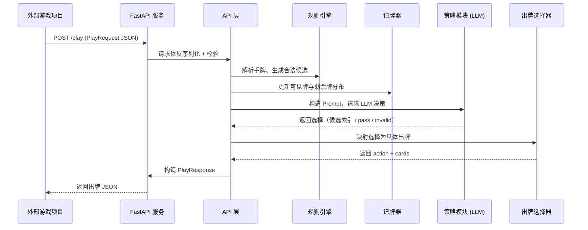
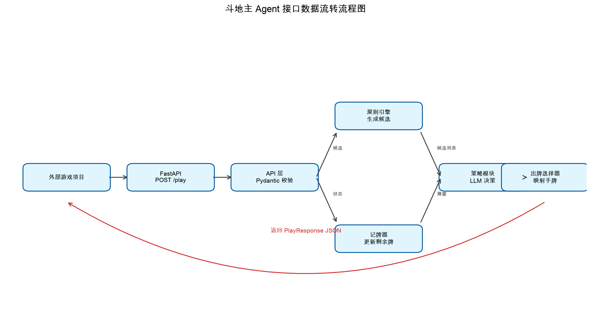
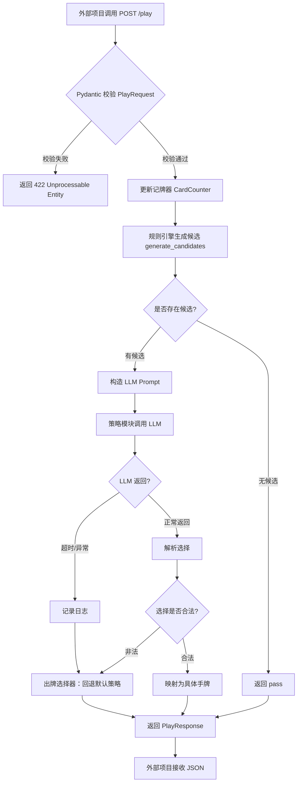
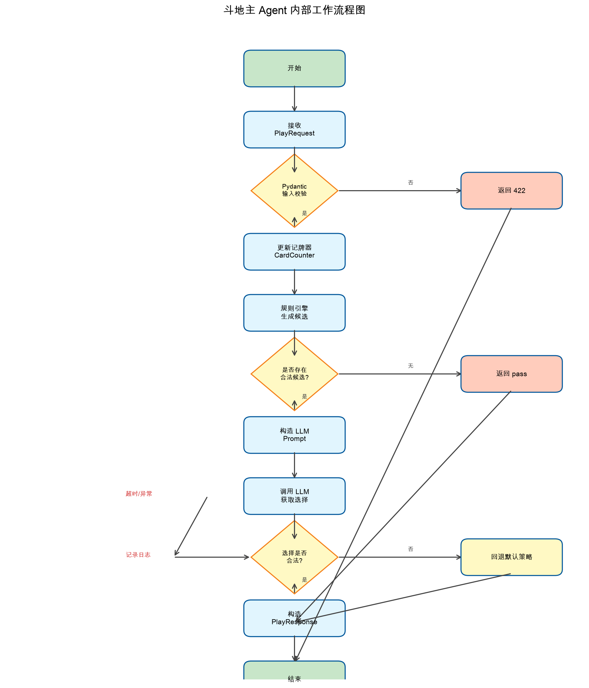
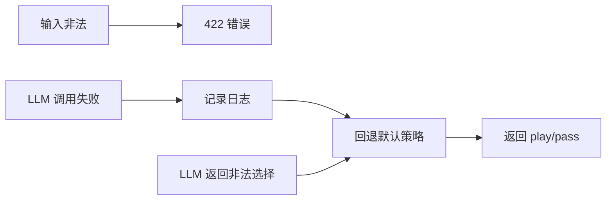

# 斗地主 Agent 工作流程与接口数据流

本文档描述 dou-dizhu-agent 的接口数据流转流程以及 Agent 内部工作流程。

---

## 一、接口数据流转流程

下图展示外部游戏项目与 Agent 服务之间通过 `POST /play` 接口进行数据交换的完整流程。



### 渲染后的流程图



### 数据流说明

1. **外部项目**调用 `POST /play`，携带当前游戏状态 JSON。
2. **FastAPI 服务**接收请求并交给 **API 层**。
3. **API 层**使用 Pydantic 模型 `PlayRequest` 校验输入。
4. **规则引擎**根据手牌和场上最后出牌，生成所有合法候选。
5. **记牌器**根据手牌、底牌、历史出牌更新剩余牌分布。
6. **策略模块**构造 Prompt，调用 LLM 从候选中选择。
7. **出牌选择器**把 LLM 选择映射为具体手牌；非法时回退到规则引擎默认策略。
8. **API 层**包装为 `PlayResponse` 返回给外部项目。

---

## 二、Agent 内部工作流程

下图展示 Agent 从接收请求到返回出牌的内部处理流程，包含正常路径和错误回退路径。



### 渲染后的流程图



### 关键节点说明

| 节点 | 说明 |
|------|------|
| Pydantic 校验 | 校验角色、手牌合法性、底牌、对手剩余牌数等 |
| 更新记牌器 | 根据 hand + bottom_cards + history + last_play 计算剩余牌 |
| 生成候选 | 首家出所有合法首出；跟牌出能管上的牌；无牌可管返回 `[[]]` |
| 构造 Prompt | 包含手牌、角色、最后出牌、对手牌数、底牌、候选列表、记牌器摘要 |
| 调用 LLM | 默认 MiniMax（OpenAI 兼容接口），可配置其他模型 |
| 解析选择 | 支持纯数字索引、`pass`、带噪声的回答（如 "candidate 2"） |
| 回退默认策略 | 非法选择或 LLM 失败时，选择最小能管的牌；无牌可管则 pass |
| 返回响应 | `{"action": "play" | "pass", "cards": [...]}` |

---

## 三、请求与响应数据契约

### 请求：`POST /play`

```json
{
  "player_id": "p1",
  "hand": ["3", "4", "5", "6", "7", "8", "9", "10", "J", "Q", "K", "A", "2", "小王", "大王"],
  "role": "landlord",
  "is_my_turn": true,
  "last_play": ["3", "4", "5", "6", "7"],
  "last_play_player": "p2",
  "other_players_card_count": {"p2": 17, "p3": 16},
  "bottom_cards": ["3", "4", "5"],
  "history": [
    {"player": "p2", "cards": ["3", "3", "3"]}
  ]
}
```

### 响应

```json
{
  "action": "play",
  "cards": ["4", "5", "6", "7", "8"]
}
```

或 PASS：

```json
{
  "action": "pass",
  "cards": []
}
```

---

## 四、异常处理流程



---

*文档生成时间：2026-06-29*
