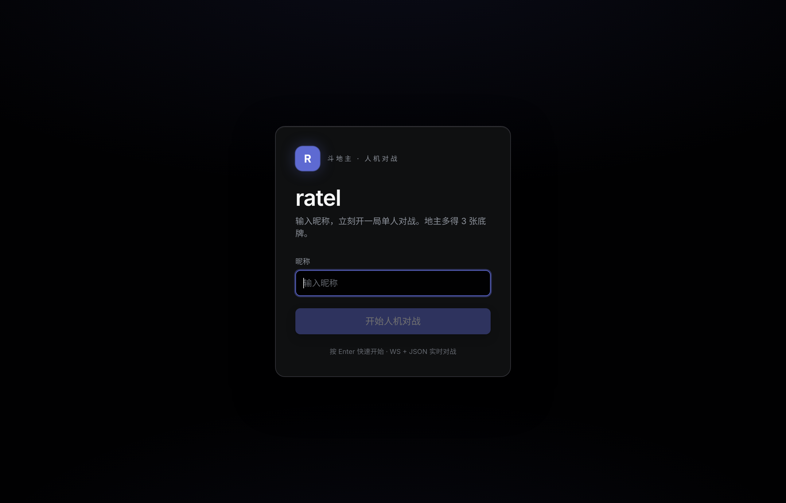
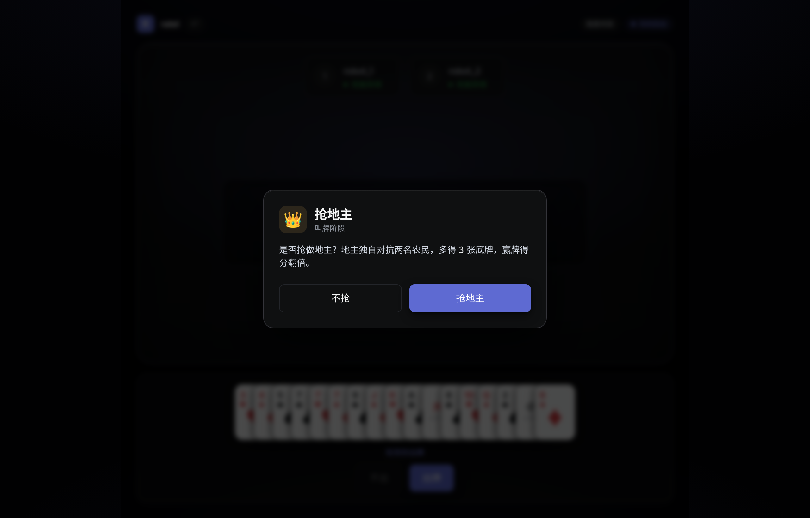
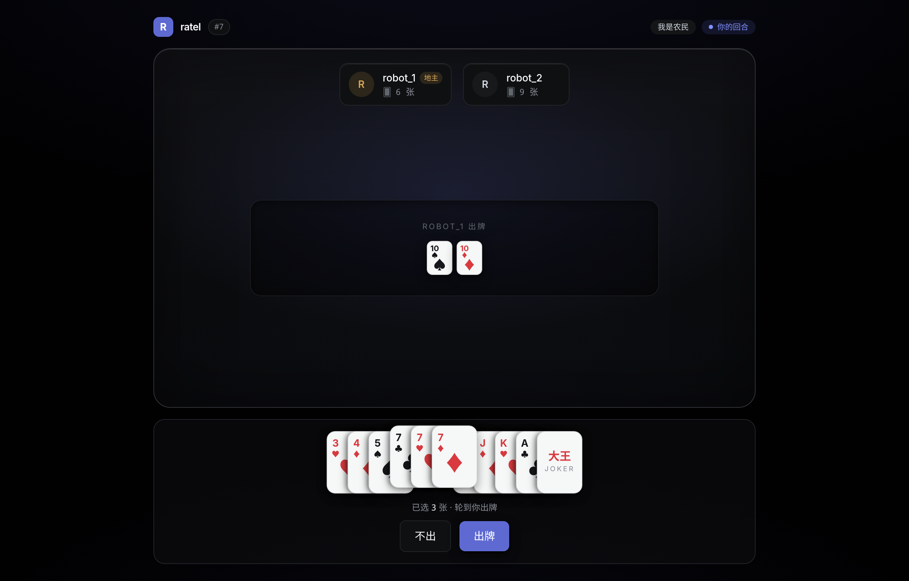
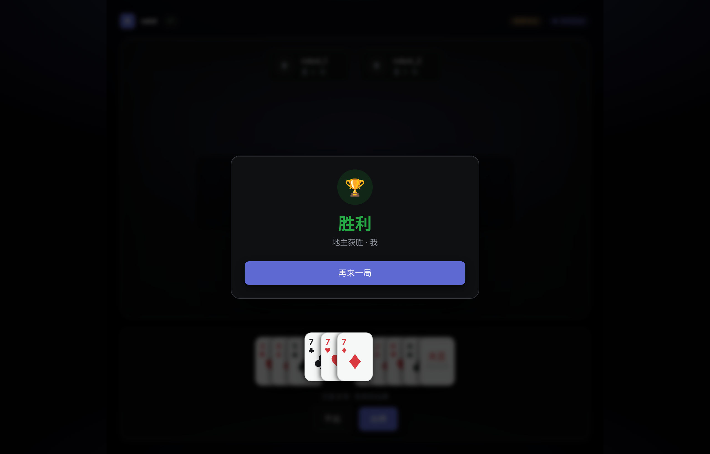

# ratel web frontend

React + Vite + Tailwind UI for the ratel 斗地主 web game. Connects to the
mock gateway (Plan 1) or the C++ gateway over the shared JSON contract.

Design tokens are derived from `DESIGN.md` (Linear, via voltagent/awesome-design-md).

## 界面预览 / Screenshots

| 大厅 Lobby | 抢地主 Bidding |
| --- | --- |
|  |  |

| 出牌 Playing | 结算 Result |
| --- | --- |
|  |  |

Real playing-card faces, a lit table surface, and the Linear-derived dark theme.
Regenerate the images from the static gallery: run `npm run dev` and open
`/screenshots.html?scene=lobby|bidding|playing|result` (rendered by
`src/screenshots.tsx`).

## Run

Start the backend first. Either the C++ gateway (from the repo root):

```bash
./gateway 127.0.0.1 8787   # ws://127.0.0.1:8787
```

or the mock gateway:

```bash
cd web/mock-server && npm install && npm run dev   # ws://127.0.0.1:8787
```

Then the frontend:

```bash
cd web && npm install && npm run dev   # http://127.0.0.1:5173
```

Open http://127.0.0.1:5173, enter a nickname, and play. To point at a different
backend, copy `.env.example` to `.env.local` and set `VITE_WS_URL`.

## Test / build

```bash
npm test
npm run build
```

## Notes

- All game rules live in the backend; this app is a state-driven view (reducer
  maps server events → UI state). See `src/state/gameReducer.ts`.
- Linear Display/Text/Mono fonts are proprietary; Inter (Google Fonts) is used
  as the documented fallback, with the DESIGN.md negative tracking applied.
